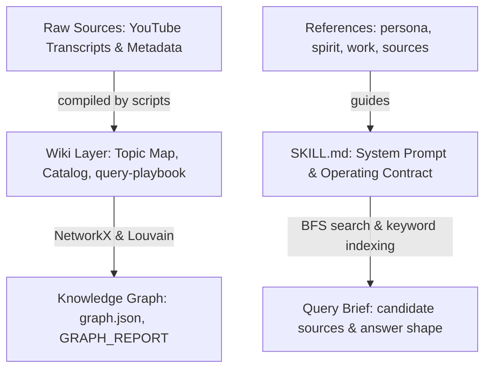

<!-- Copyright (c) 2026 Falo x Force Cheng. All rights reserved. Created on 2026/6/15. -->

# 【AI 傳教師導讀】從 Cosplay 到心智蒸餾：李宏毅 .skill 專案拆解報告

> 🔗 **[⬅ 回到 Good Repo 總入口](../good-repo/README.md)** | **[👉 查看深度解析網頁](./index.html)**

---

## 導讀前言：AI 傳教師與顧問的實務省思

作為一名站在技術、產業與教育交界的 **AI 綜合顧問、老師與傳教師**，我常被問到一個根本性的問題：「我們如何能縮短人與 AI 的距離，讓人工智慧不再冷冰冰，而是真正具備人類專家的溫度與智慧脈絡？」

大部分企業在尋求 AI 落地時，往往流於生硬的 Prompt 或僅是在系統提示詞中做淺層的語氣模仿（Cosplay）。然而，`voidful/hung-yi-lee-skill` 這個專案，為我們展示了一個全新的範式移轉：**「心智蒸餾（Mind Distillation）」**。

> 「這項技術的應用面極為寬廣。在任何需要擬真交互的合法場合，我們都能藉此複製頂尖專家的思考模式。對我而言，這讓教材編撰變得無比輕鬆——AI 代筆起草，人類導師只需校稿與把關。我們可以隨時邀請不同領域的大師，跨越時空來為我們抓刀。」

在本篇教案中，我們將從**「新（創新範式）」**與**「實用（落地價值）」**兩個面向，深度探討這套專案是如何在不依賴昂貴資料庫的前提下，把一個大師級老師的「知識圖譜」與「教學靈魂」裝進 AI 系統中的。

---

## 相關資源與參考連結 (本地/GitHub 友善)

-   📦 **當前時間點本地資源包**：[下載專案 ZIP 資源包](./hung-yi-lee-skill_20260615_094012.zip) *(當前時間點 2026/06/15 的完整專案、圖譜與 Wiki 快照)*
-   💻 **GitHub 原始倉庫**：[voidful/hung-yi-lee-skill](https://github.com/voidful/hung-yi-lee-skill)
-   💬 **Threads 社群原始貼文**：[@amikaiii/post/DZkxfn-GH6O](https://www.threads.com/@amikaiii/post/DZkxfn-GH6O)
-   📺 **原始課程來源**：[台大李宏毅教授官方 YouTube 頻道](https://www.youtube.com/channel/UC2ggjtuuWvxrHHHiaDH1dlQ)

---

## 1. 專案核心架構與 Pipeline

這個專案遵循一個結構化的 **「LLM Wiki + Knowledge Graph」** 模式，並非僅提供一個簡單 Cosplay System Prompt，而是建構了完整的數據與檢索流水線。



### 1.1 核心層級結構

-   **Raw Sources (`raw/`)**：唯讀的原始數據源，包含 YouTube 影片的 Metadata 及 27 份快取的逐字稿 Markdown 檔案。
-   **Wiki Layer (`wiki/`)**：由大模型或編譯指令維護的知識庫，包含主題分類地圖（`topic-map.md`）、教學風格定義（`teaching-style.md`）及查詢指南。
-   **Knowledge Graph (`wiki/graph/`)**：包含持久化的圖譜數據 `graph.json`、視覺化網頁 `graph.html` 與圖譜分析報告 `GRAPH_REPORT.md`。
-   **Curated References (`references/`)**：定義老師教學心智模型（Mental Model）的靜態指南，如 `persona.md`（語感）、`spirit.md`（教學哲學）與 `work.md`（技術範疇）。
-   **Operating Skill (`SKILL.md`)**：LLM 載入的系統提示詞，規範回答時的語氣、字頻、節奏與教學步驟。

---

## 2. 語感與教學 DNA 工程化（`SKILL.md`）

專案最重要的特色是精準對齊李宏毅老師的教學方式，包含了以下幾個工程化設計：

### 2.1 逐字稿口語字頻對齊
通過分析 5.8 萬個影片字幕片段，精確規範 AI 在回答時混合使用英文專有名詞與特定中文語助詞的頻率：
-   **比如說** (609 次)：預設舉例標記，不使用書面語「舉例來說」。
-   **假設** (518 次)：開啟思想實驗，引導學生進入情境（例如：「假設你今天想要...」）。
-   **這樣子** (230 次) & **而已** (160 次)：用於句尾的軟化與 punctures（去神秘化），例如：「其實就是...而已」。
-   **硬 train 一發**：當表示端到端（end-to-end）暴力訓練時的招牌代名詞。

### 2.2 穩定的教學結構 DNA
限制 AI 回答時必須遵循五步結構：
1.  **直覺先行**：用一句大白話或日常類比（例如「暗房裡的人」）點出概念。
2.  **Black Box 描述**：先講輸入（Input）、輸出（Output）與目標（Objective），不急著拆解細節。
3.  **開箱機制**：由淺入深說明內部架構（如 Query, Key, Value 運算）。
4.  **陷阱警告**：指出常見誤解、硬體與理論限制、Debug 取捨。
5.  **暖心回顧 (Recap)**：用一句話總結，並像下課一樣俐落收尾。

### 2.3 問題導向的「怎麼辦呢？」
在介紹 any 演算法或機制之前，必須設計一個「痛點（Pain Point）」，並使用問句「怎麼辦呢？」做轉折，讓學生的注意力被吊起來，再適時引入該技術。

---

## 3. 圖譜引擎與社群偵測（`hungyi_graph.py`）

這套系統不依賴 Vector Embedding 計算，而是以實體關係圖（Entity-Relationship Graph）為基礎。

-   **節點類型**：`video`（影片）、`concept`（概念）、`topic`（主題）、`series`（系列）與 `reference`（參考文件）。
-   **邊的類型與置信度 (Audit Convention)**：
    -   `EXTRACTED`：從文本中通過正則規則提取的顯式提及關係（置信度 1.0）。
    -   `INFERRED`：推論關係。若兩個 `concept` 同時出現在多個不同的影片中，系統會將其標記為 `co_mentioned`（共同提及）並依共同出現次數給予對應的權重。
-   **Louvain 社群分類**：
    利用圖拓撲結構將 916 個節點自動劃分為 10 個核心概念社群（例如 Speech And Audio、Agents、Diffusion And Generation 等）。
-   **關鍵節點與驚喜關聯**：
    -   **God Nodes**：連接度（Degree）極高的概念路口，如 `ML Fundamentals`（Degree 385）與 `語言模型`（Degree 251）。
    -   **Surprising Connections**：跨越不同 Louvain 社群邊界的非直覺關聯，例如：概念 `解剖` 與 `DeepSeek-R1 影片` 之間的交點。

---

## 4. 為什麼這套系統優於傳統靜態 RAG？

| 特性 | 傳統 Vector RAG | 本專案 Skill 模式 |
| :--- | :--- | :--- |
| **知識關聯** | 靠 Embedding 相似度搜尋，無法理解巨觀的知識脈絡。 | 基於 NetworkX 的 **BFS 搜尋與 shortest path**，自動理出概念脈絡。 |
| **可追溯性** | 段落截斷可能遺失上下文，來源標註模糊。 | 精確定位至課程逐字稿的**時間戳記（Timestamp）**，具備高度 Factuality。 |
| **架構連貫性** | 每次問答相互獨立，知識無法自我疊加。 | 自動生成並編譯 `Query Brief`（查詢卷宗），實現**知識的自我演進與累積**。 |

---

## 5. 指令速查 (CLI Tooling)

```bash
# 1. 抓取頻道影片清單
python3 scripts/hungyi_kb.py sync-metadata

# 2. 下載並快取逐字稿 (以生成式AI相關影片為例)
python3 scripts/hungyi_kb.py sync-transcripts --title-contains "生成式AI"

# 3. 編譯 Wiki 文件與索引網頁
python3 scripts/hungyi_kb.py compile

# 4. 關鍵字快速檢索
python3 scripts/hungyi_kb.py search "attention" --limit 5

# 5. 建立知識圖譜並生成報告
python3 scripts/hungyi_kb.py graph build

# 6. 向圖譜引擎提問（檢索關聯路徑）
python3 scripts/hungyi_kb.py graph query "transformer"
```
